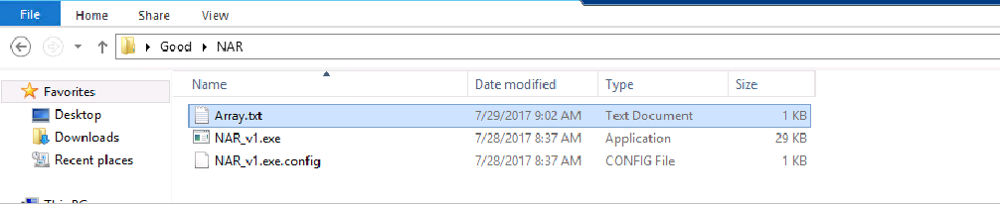
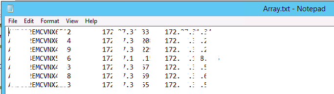
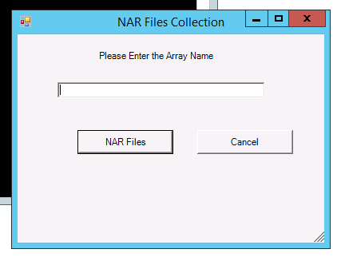
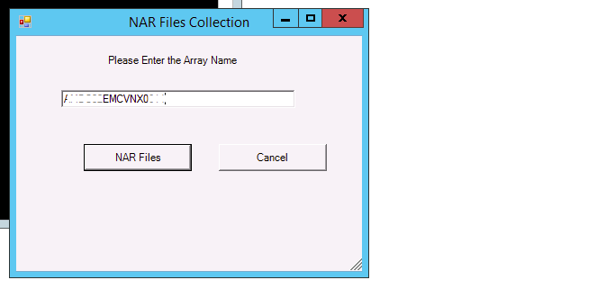
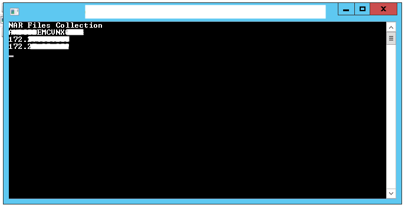
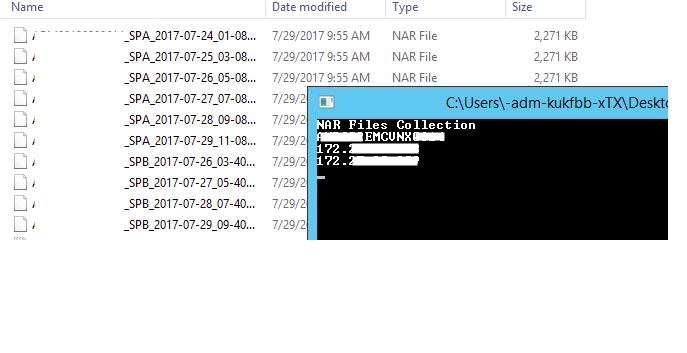
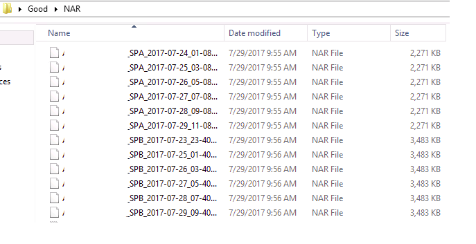

# Powershell script to collect the NAR files from EMC Storage array

## Storage models supported - EMC VNX and EMC Clariion arrays

### Note : This would give the last 5 days NAR files for both SPA and SPB

### Prerequisites : 
Please maintain a text file with name Array.txt in the below format
Array_Name SPA_IP_Address SPB_IP_Address in the same folder where you have NAR exe file

### Steps given below

1.  Copy the exe folder from Github to any folder in the server from where you can access storage array using naviseccli.  

2.  Format of Array details in Array.txt is as given below  

3.  Open the exe file (NAR_v1.exe), this would open up a GUI.  

4.  Enter the array name in the Textbox and click NAR Files button.  
    
5.  GUI will be closed and command window be open until the execution is completed.  

6.  NAR files will start getting downloaded instantly to the same folder.   

7.  After the completion command window will be closed and last 7 days (including present day) NAR files for both SPA and SPB will be found in the same folder.  
