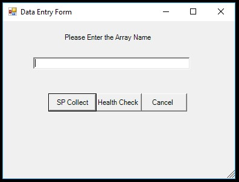
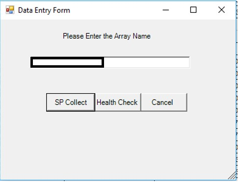
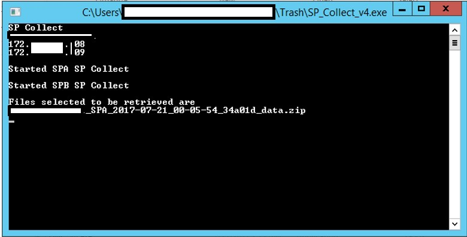
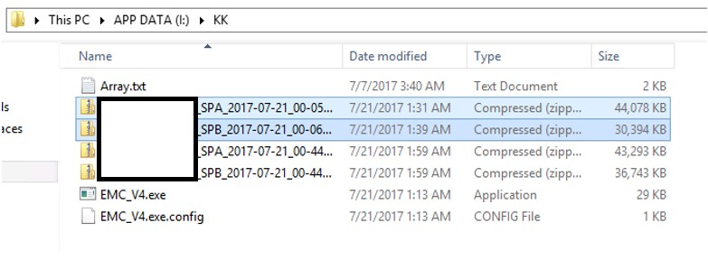
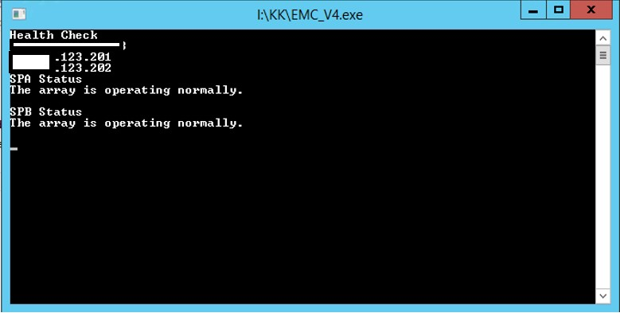

## EMC SP Collect and Health Check 

### Powershelll script to collect SP logs from EMC Array and to perform the instant health check.

#### Storage Arrays supported - EMC VNX and Clariion boxes.

### The detailed procedure is given below

1.  Open the EMC_V4.exe file.

    
    

2.  Enter the array name as spefied in the Array.txt file.

    

3.  For generating SP Collect Click on SP Collect button. This will open up a command prompt window showing the task progress.

    

4.  After the completion, SPA and SPB collects would be available in the same folder.

    

5.  For checking the health of the array open the exe application, enter the array name and click on Health Check button. This will open the command prompt showing the health status.

    
